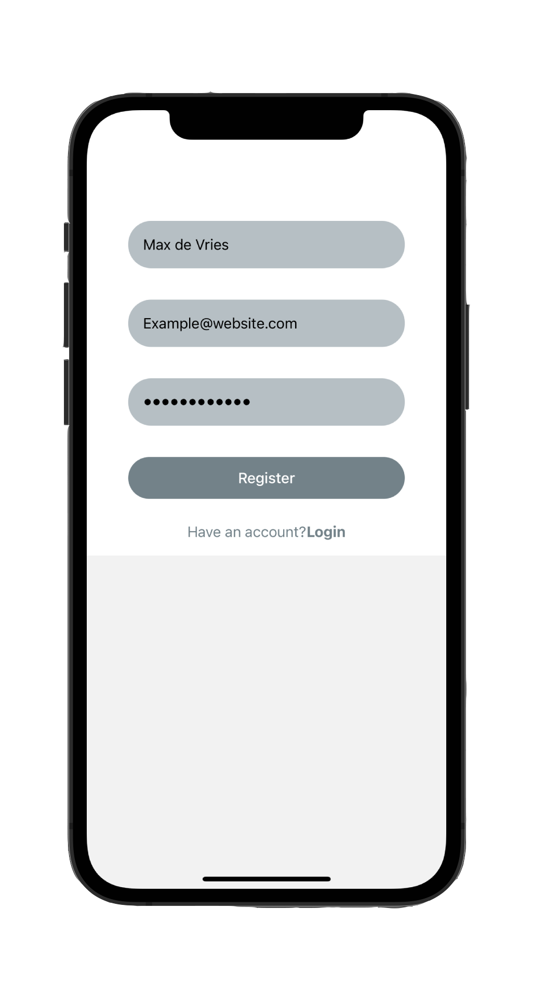

# Authentication System App

[1]: https://github.com/vriesm060/authentication-system-app-client
[2]: https://github.com/vriesm060/authentication-system-app/tree/master/server

| [Client][1] | [Server][2] |
| :---------- | :---------- |

  
  

